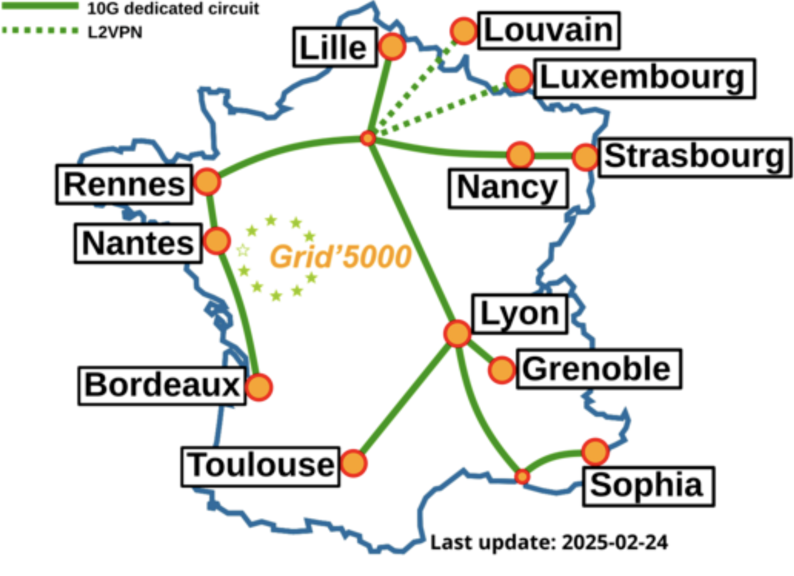
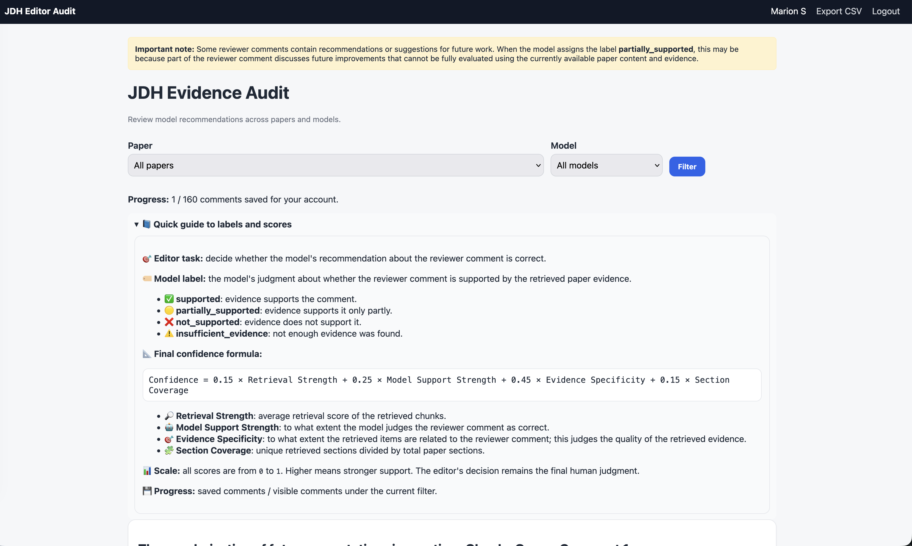
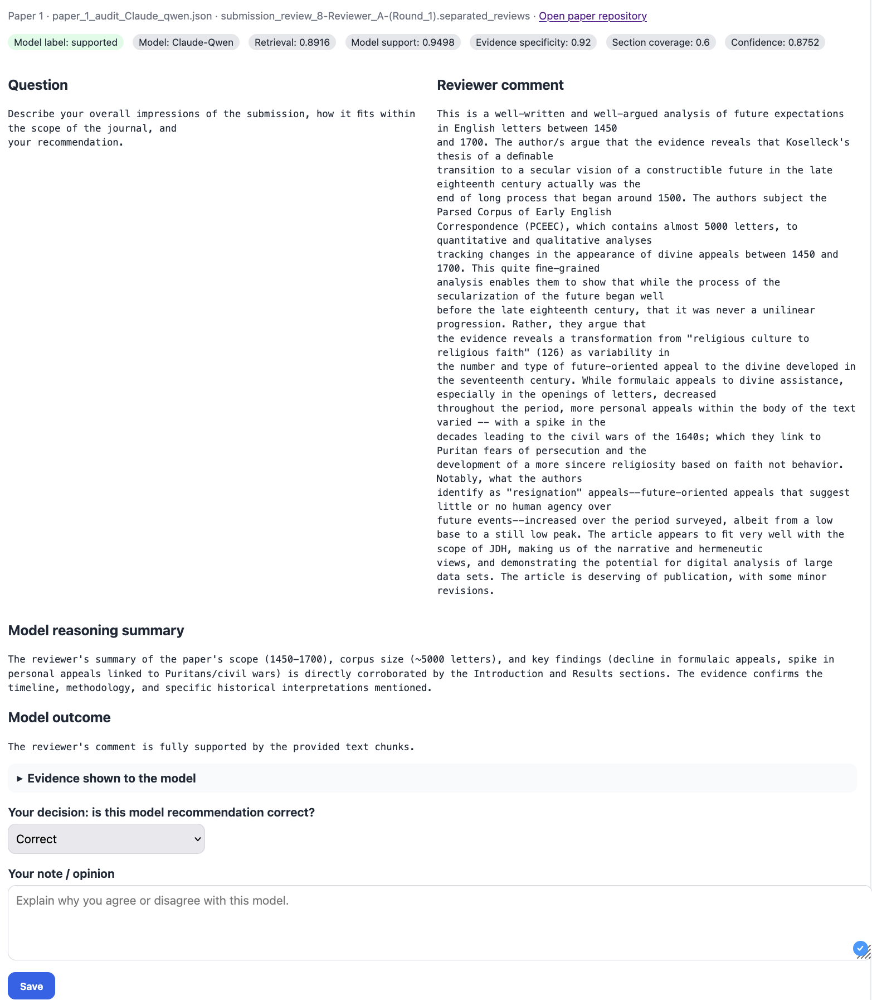
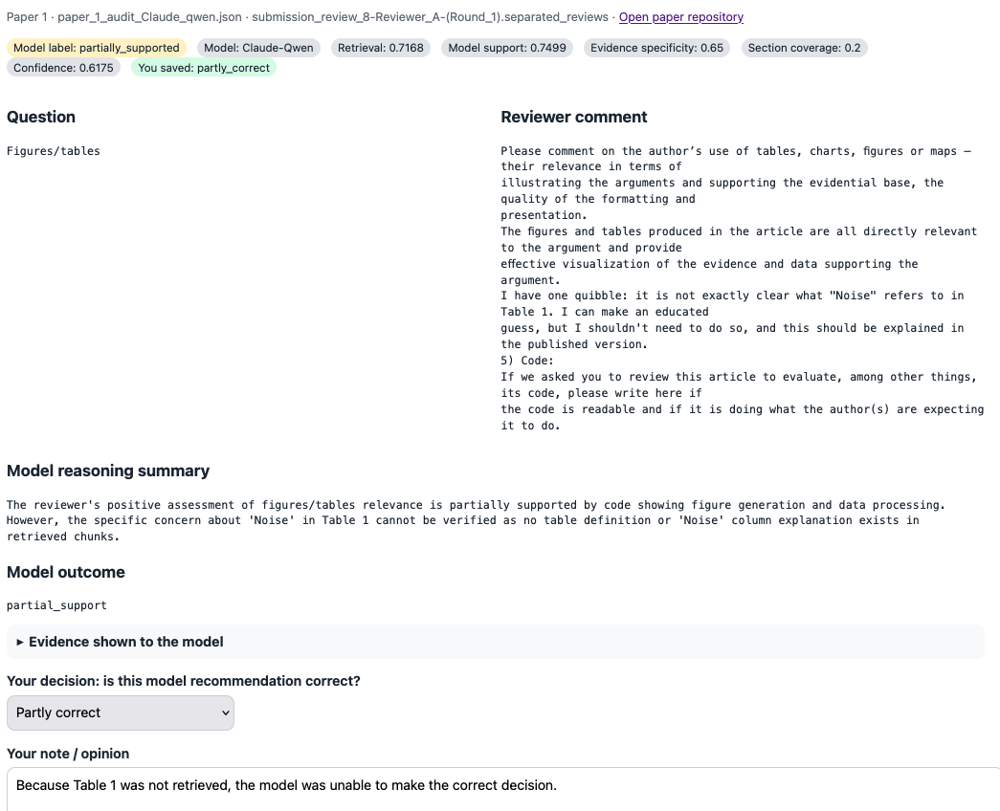
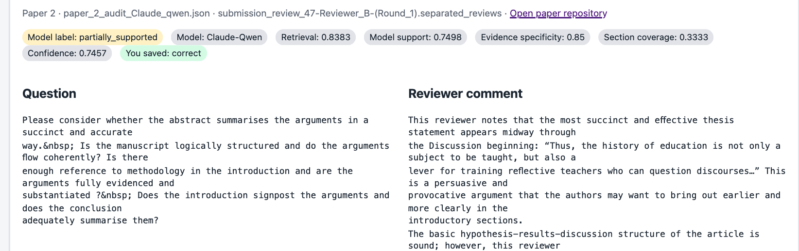
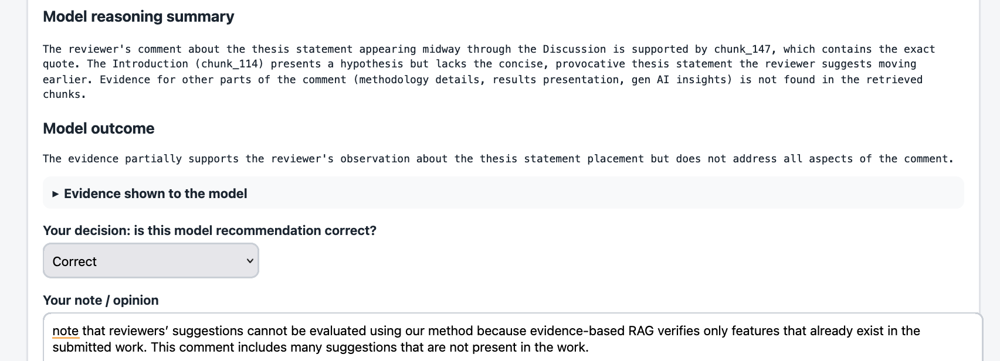
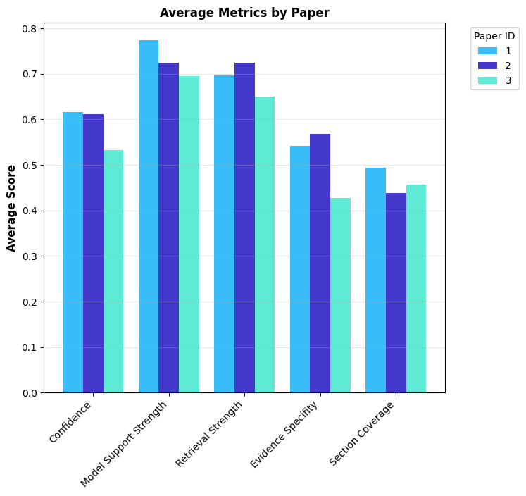
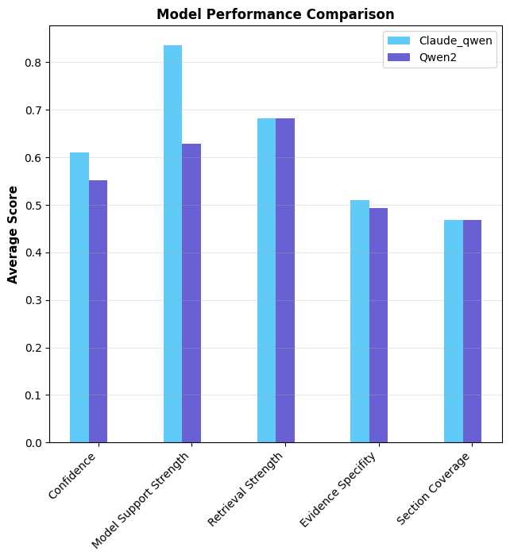
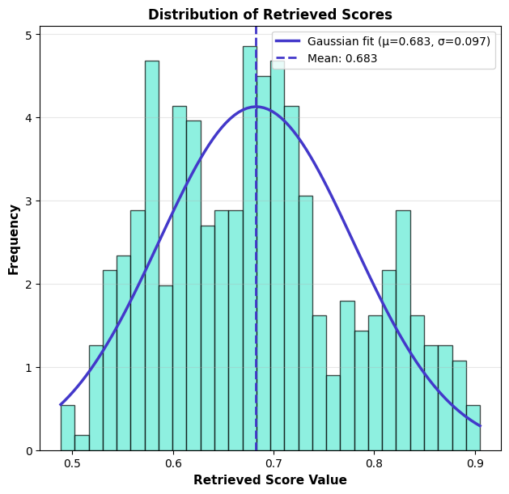
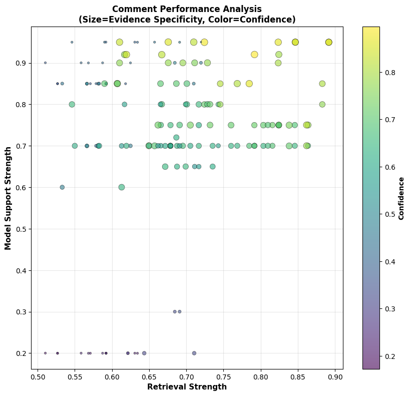

# Plan

- Introduction
- Challenges about peer review
- Evidence RAG 
- What should be the future steps ? 
- POC

::: notes 
Frédéric
:::

# Introduction

........

::: notes 
Frédéric
:::

# Challenges about peer review

- Editorial decisions might rely on subjective interpretation of reviewer comments.
- Review processing is time-consuming.
- Important evidence can be overlooked when papers are long and complex.
- Limited transparency makes it difficult to justify editorial decisions, see @martinboyle2026papertrail.
- Manual review processes are difficult to scale as submission volumes increase, see @sen2025rigor. 

::: notes 
Frédéric
:::

# Advantages of our work for peer review

- Supports editors by linking reviewer comments to paper evidence.
- Makes peer review decisions more transparent and explainable.
- Reduces manual effort in checking whether comments are supported.
- Combines RAG retrieval with model-based evidence evaluation.
- Provides confidence scores to help prioritize difficult cases.
- Keeps the human editor as the final decision-maker.
- Helps identify unsupported, partially supported, or unclear reviewer comments.

# Evidence RAG

1. Infrastructure : Grid5000 or local model
2. Pipeline
3. JDH evidence audit application
4. Results

# Infrastructure

:::: {.columns}
::: {.column width="50%"}
**Grid5000** is a large scale and flexible testbed for experiment-driven research in all areas of computer science.

- Reliable research infrastructure.
- Supported GPU-based execution of large language models.
- Available in Europe
- Helped ensure more controlled and reproducible model testing.

:::
::: {.column width="50%"}

:::
::::

# 

{fig-align="center"}

# JDH evidence audit app

#

#

#

# Results

#

:::: {.columns}
::: {.column width="50%"}
{}
:::
::: {.column width="50%"}
- text placeholder
- text placeholder
- text placeholder
- text placeholder
- This is a test
:::
::::

::: notes 
Mehrdad
:::

# 

:::: {.columns}
::: {.column width="50%"}
{}
:::
::: {.column width="50%"}
- text placeholder
- text placeholder
- text placeholder
- text placeholder
:::
::::

# 

:::: {.columns}
::: {.column width="50%"}
{}
:::
::: {.column width="50%"}
- text placeholder
- text placeholder
- text placeholder
- text placeholder
:::
::::

# 

:::: {.columns}
::: {.column width="50%"}
{}
:::
::: {.column width="50%"}
- text placeholder
- text placeholder
- text placeholder
- text placeholder
:::
::::

# Future Steps

What are our next steps ?

1. Test the system with more papers and reviewer comments.
2. Compare results across different models and retrieval settings.
3. Improve the confidence score with editor feedback.
4. Extend the system to support more journals and disciplines.

# Proof of Concept (POC)

# 



:::notes
The video length is 3 minutes.
:::

# Bibliography
