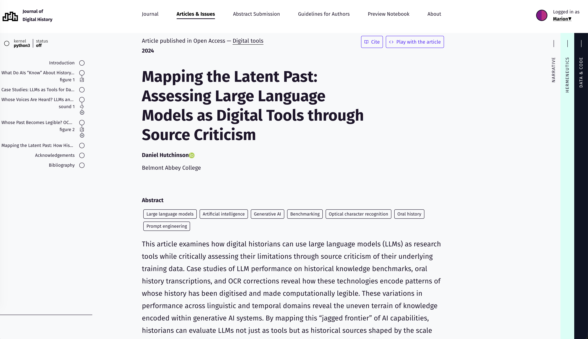
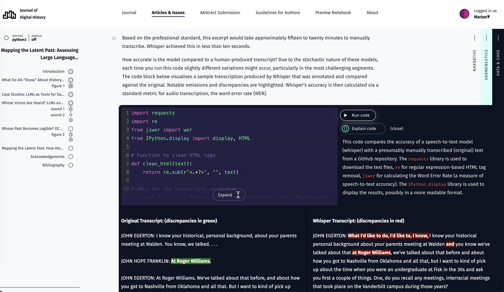
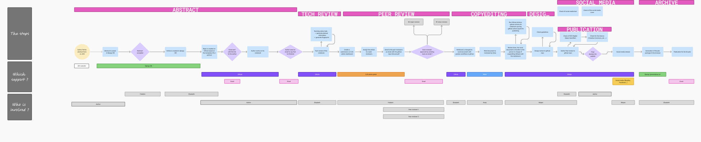
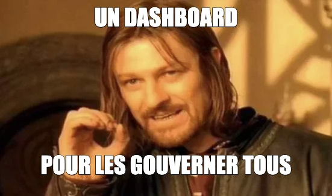
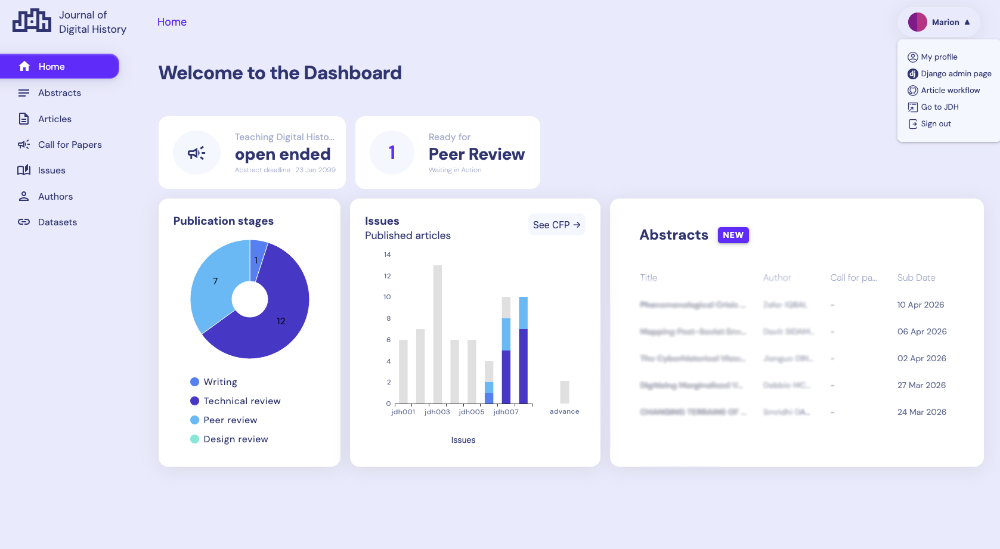
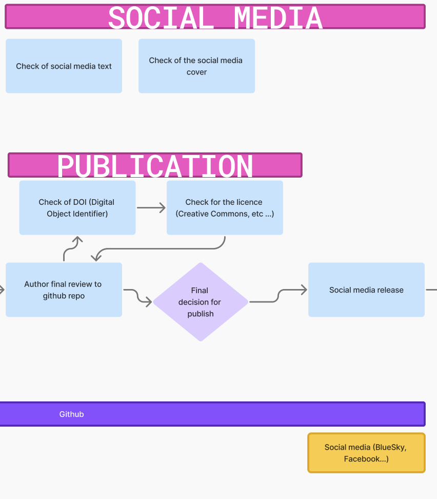
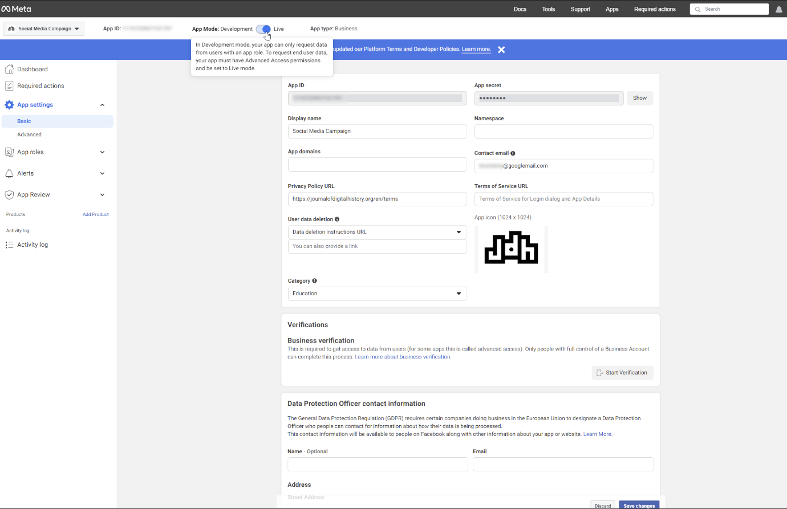
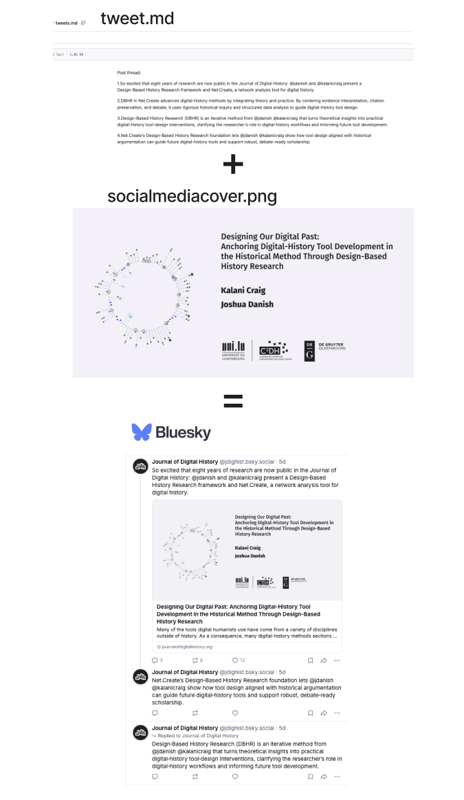
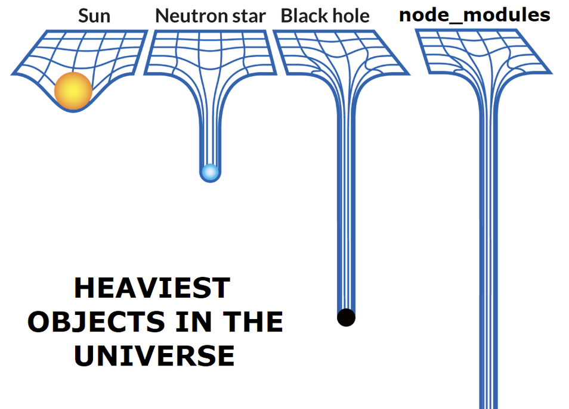

# Plan

- Qu'est-ce que le JDH ?
- Gestion d'un journal
- Les réseaux sociaux dans le dashboard
- Les problèmes rencontrés
- La plannification
- Pourquoi automatiser ? 
- Qui communique ? 
- Conlusion

::: notes 
Marion
:::

# Qu'est-ce que le JDH ? 

Journal of Digital History (JDH)

Journal académique en ligne basé sur le principe de plusieurs niveau de lecture pour chaque article (narratif, herméneutique, code et données).
Le journal est en accès libre et n'engendre aucun coût que ce soit pour les auteurs ou pour les lecteurs. 

Lien : [https://journalofdigitalhistory.org/](https://journalofdigitalhistory.org/) 

En association avec la maison d'édition De Gruyter Brill.

**Nouveau numéro** : IA et Histoire

::: notes 
Marion
:::

# 



::: notes 
Marion
:::

#



::: notes 
Marion
:::

# Gestion d'un journal

- gérer les soumissions : accepter, décliner, etc...
- contacter les auteurs régulièrement
- réaliser des revues techniques de leur travail (débugger le code, vérifier que les packages soient bien installés etc...)
- corriger les erreurs de frappes, orthographe, etc..
- vérifier la mise en page
- etc... x10 000

# Flux

🎨 Lien [Figma](https://www.figma.com/board/qSfyxRc0vBFFihmLDjsJm4/JDH-submission-process?node-id=0-1&p=f&t=JG1Q03iGhjN3EPC8-0)



... et c'est loin d'être exhaustif !

::: notes 
Marion
:::

# Solution ? 



::: notes 
Marion
:::

# Dashboard



::: notes 
Marion
:::

# Rappel : le flux

Pour cette fois-ci, essayons de focus sur un point précis ...


# 

... les réseaux sociaux.



#Les réseaux sociaux dans le Dashboard

[Intégrer une vidéo de démo de la planification des réseaux sociaux ici]

::: notes 
Marion
:::

# Problèmes rencontrés


|                       | Facebook               | Bluesky             |
|-----------------------|-------------------|----------------------|
| Nombre de publication/réponse                 | une publication unique               | une publication et jusqu'à 5 réponses   |
| Nombre de mots               | 63,206          | 300   |
| Qualité de la documentation  |   ❌                | ✅                    |
| Créer un compte    | ❌  Accepter de se faire prendre en photo             | ✅ Simple                  |
| Tester    |   ❌                | ✅                    |
| Token pour l'API             | Difficile à obtenir               | ✅                    |
| Administrateur | ❌ lié au compte utilisateur               | ✅     |
| Stockage du post dans l'API       | ✅                   | ❌   |

# Un exemple de parcours du combattant 

Pour obtenir un token qui a une durée illimitée avec Facebook, il vous faudra : 

1. Un `long-lived user access token` (dure 60 jours) avec la requête suivante

````
curl -i -X GET "https://graph.facebook.com/{graph-api-version}/oauth/access_token?       
  grant_type=fb_exchange_token&               
  client_id={app-id}&     
  client_secret={app-secret}&     
  fb_exchange_token={your-access-token}"
````

2. Il faut récupérer l'`app-id`
3. L'`app-secret`
4. Puis générer l'`access-token` 

#

5. Une fois que l'on a récupérer tout ça, on doit récupérer un `long-lived page access token`
6. Il faudra pour ce faire... récupérer la `graph-api version`
7. Puis le `app-scoped-user-id`
8. Et réutiliser le `long-lived user access token` obtenu à l'étape 5 🤪



# 

Et puis, il faut planifier donc gérer **une heure** de planification avec un `scheduler`.

:::: {.columns}
::: {.column width="50%"}
{height="700px"}
:::
::: {.column width="50%"}
{height="700px"}
:::
::::


# Mais si c'est aussi complexe, pourquoi automatiser ? 

# ... parce que automatiser amène aussi des avantages

#

- risque d'oubli sur le "comment faire" par l'humain car on ne publie pas tous les jours
- vérification systématique si tous les fichiers sont présents (`tweet.md`, `socialmediacover.png`)
- libère du temps pour d'autre tâche(s) : aider les auteurs par exemple
- permet d'investir la possibilité de **répliquer** sur d'autres réseaux sociaux (Linkedin, Mastodon, Threads...)

mais surtout...

# 

Apprentissage de nouvel compétence (code, vision d'ensemble des étapes) que ce soit par l'équipe mais aussi par nos étudiants.

En programmation, on ne réinvente pas la roue à chaque fois.

{.lightbox}

# À qui de communiquer ?

`Tweet.md` qui l'écrit ?

- l'auteur ? à tendance à l 'oublier
- l'éditeur ? ne connaît pas aussi bien l'article que l'auteur 
- l'IA ? mais dans ce cas doit impérativement être relu par quelqu'un et probablemet recorriger

# Conclusion

> « Quand un homme a faim, mieux vaut lui apprendre à pêcher que de lui donner un poisson. » par Confucius (@bouffard_chapitre_2011) 

.")


# Bibliography

