# Review of the year

- 2025 annual review
- dashboard
- call for papers
- harmonization 

::: notes 
Frédéric
:::

# 2025 annual review

See [here](https://hackmd.io/@Gol_yEahR0aJeDHjZ1CZ-g/H1v1q1vzbe) 

- Published the most ever
- Frequentation high from January to May → period of the launch of CFP AI& History
- Frequentation linked to social media campaign and workshop

- Frequentation external links: DOI / GitHub / Orcid / MyBinder

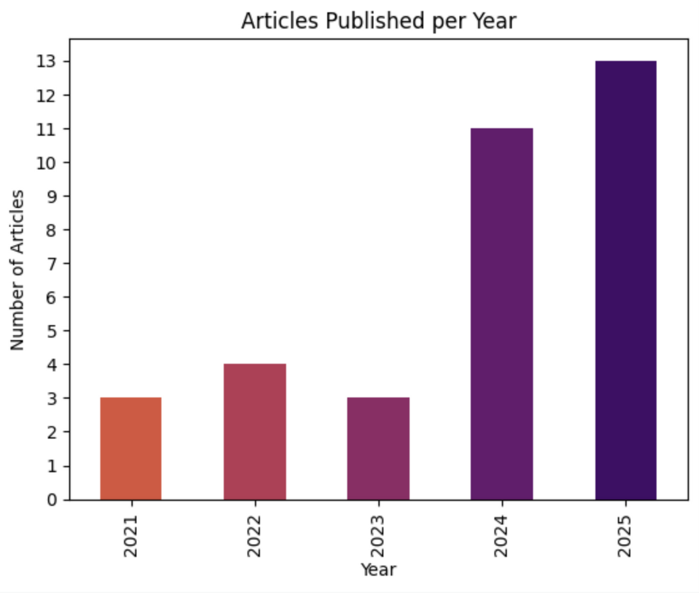{.r-stretch fig-align="center"}

::: notes 
Frédéric
:::

# Dashboard overview

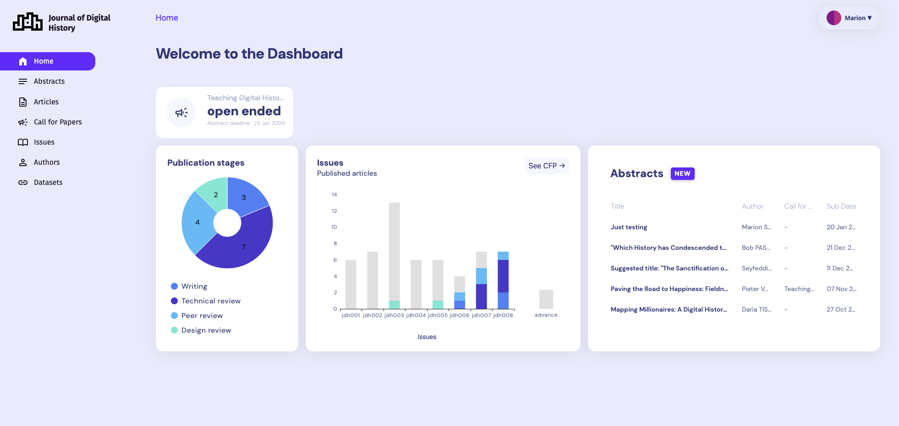{.absolute top=140 right=0 width="700"}

- notification
- counters with due date
- KPI
  - pie chart
  - bar chart
  - new abstracts tile
- hypothes.is
- contact form
- social media campaign (Facebook and Bluesky)
- responsive table
- log in/log out menu in the right top corner

::: notes 
Marion
:::

::: notes 
Marion
:::

# Tablet & mobile

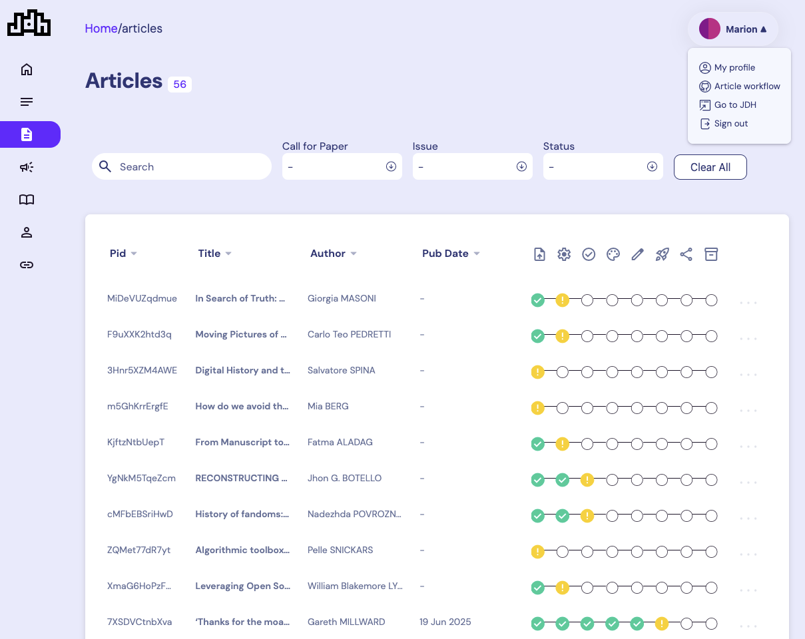{.absolute top=180 left=0 width="700" }
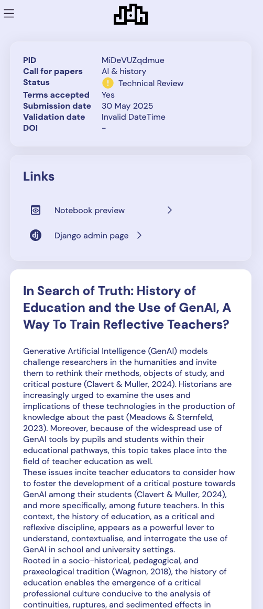{.absolute top=180 right=100 width="240"}

::: notes 
Marion
:::

# What's next ?

- new KPIs
- create OJS submission 
- author page refactoring
- create an article from abstract detail page
- and more... 😃

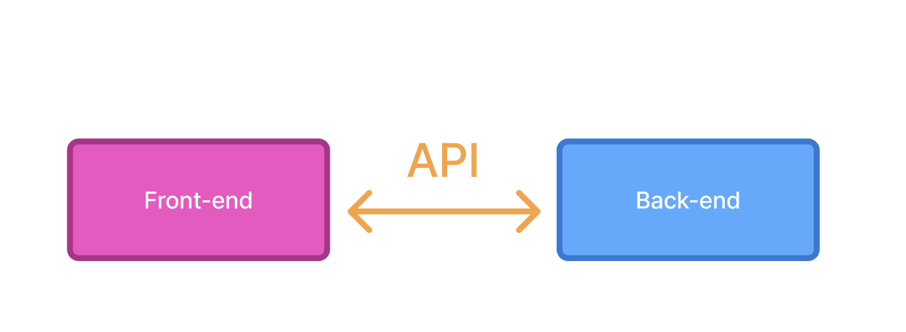{.absolute top=180 right=25 width="500" height="200"}

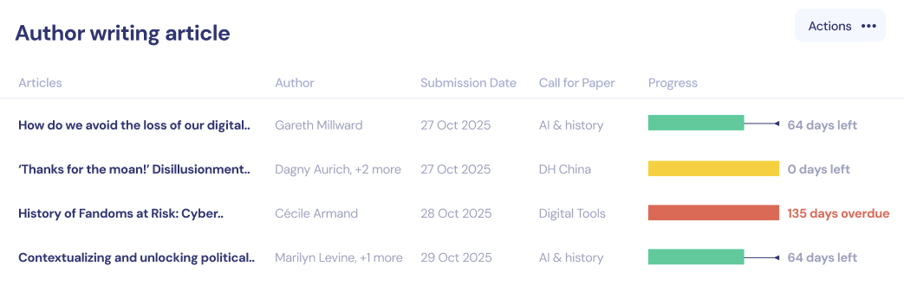{.r-stretch fig-align="center"}

::: notes 
Marion
:::

# Harmonization 

In progress 

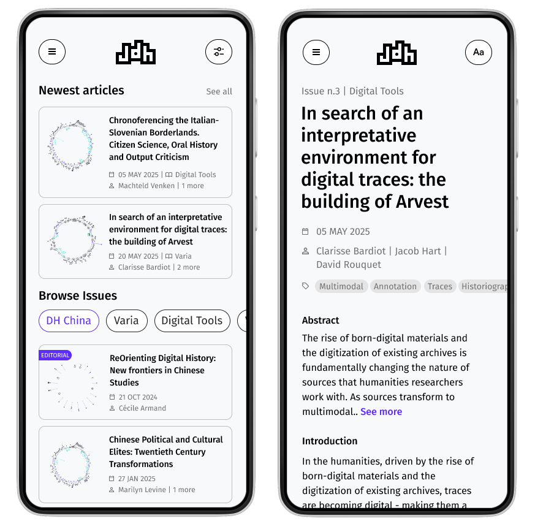{.r-stretch fig-align="center"}

::: notes 
Mirjam
:::

# PDF

Curvenotes started the project : feedback coming soon.

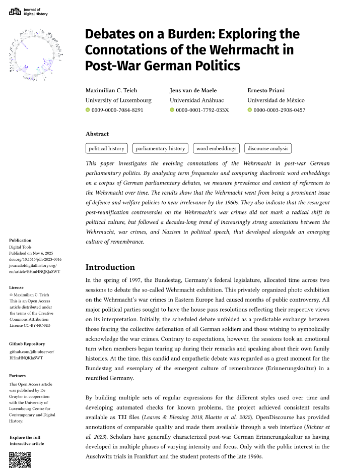{.absolute top=180 left=25 width="500" height="2000"}
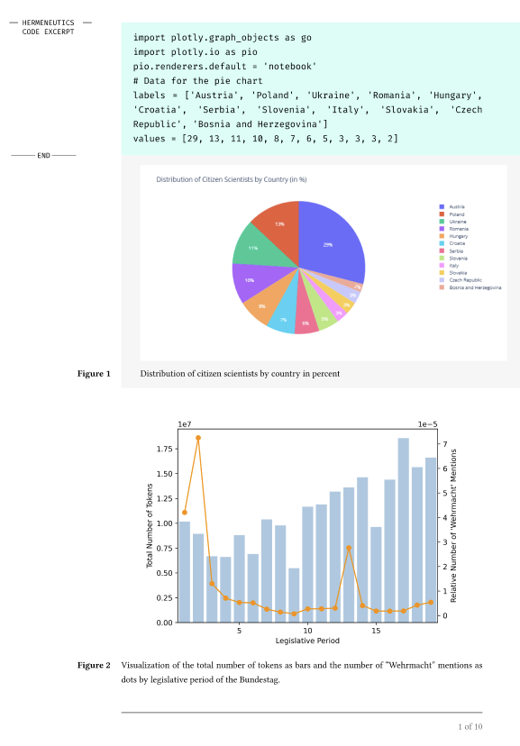{.absolute top=180 right=25 width="500" height="2000"}

::: notes 
Mirjam
:::

# Call for papers

- **AI & History** : presentation by Frédéric ([dashboard](https://journalofdigitalhistory.org/dashboard))
- **Early Modern English Manuscripts and Their Metadata at Scale** (Caitlin Burge, Kyle Dase, and Erin A. McCarthy -- In preparation)

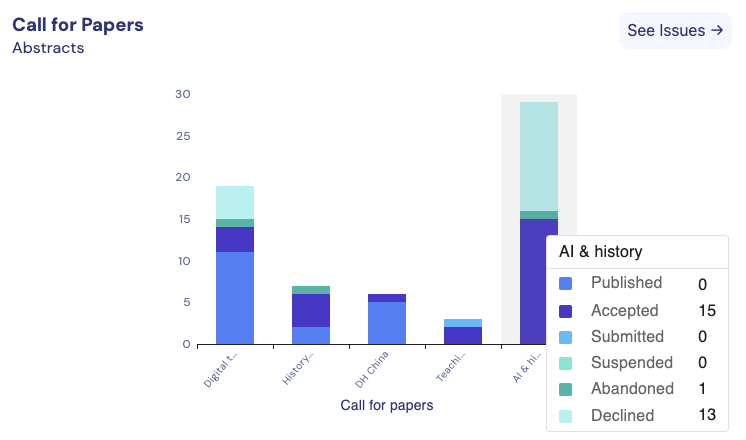{.absolute top=300 left=0 width="500"}
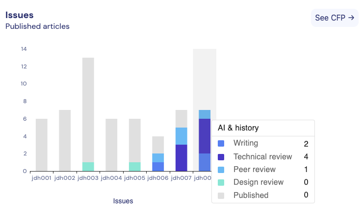{.absolute top=300 right=0 width="500"}

::: notes 
Frédéric
:::

# Visualisation framework

Presentation by Aida

::: notes 
Aida
:::

# Future ideas

::: notes 
Marion
:::

# AI exploration guideline

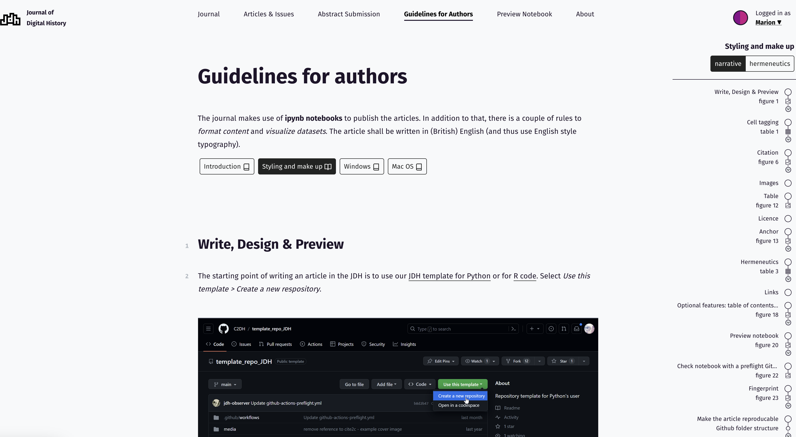{.r-stretch fig-align="center"}

Demo with [Devin](https://deepwiki.com/pkp/ojs/4.1-submission-process)

::: notes 
Marion
:::

# AI in peer review

> More than half of researchers now use AI for peer review — often against guidance see @naddaf_more_2025

::: notes 
Elisabeth
On this 50% :
29% to summarize the manuscript
identify gaps or check references
28% to flag potential signs of plagiarism and image duplication 
:::

# AI vs Human

|                       | AI                | Human                |
|-----------------------|-------------------|----------------------|
| General comments       | ✅                 | ✅                    |
| Content                | ❌                 | ✅                    |
| Structure and argument | ❌                 | ✅ added value         |
| Figures / tables       | ?                  | ✅ Aida framework     |
| Code                   | ✅                 | ❌ not in practice    |
| Language               | ✅                 | ❌                    |
| Ethical approval       | ❌                 | ✅                    |
| Data / primary sources  | ✅                | ❌                    |

: AI vs Human in peer review 

::: notes 
Elisabeth
experiment to test whether the LLM could review a Nature Communications paper
compared the AI-generated output with the actual peer-review reports
conclusion:  mimic the structure of a peer-review report and use polished language
but that it failed to produce constructive feedback
- already solution Frontiers piloted an in-house AI tool 
summarizing a manuscript or checking whether the research fits the journal’s scope
- some researchers are running their own tests to determine how well AI models support peer review
:::

# Timeline article

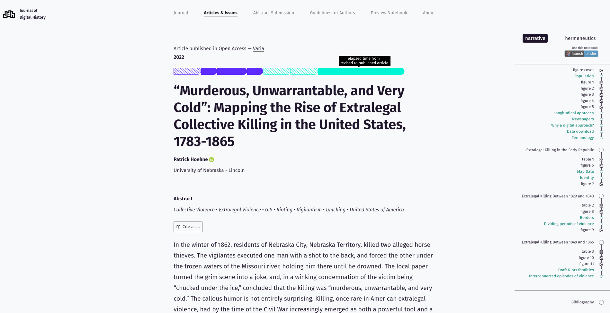{.r-stretch fig-align="center"}

::: notes 
Mirjam
:::

# Entry points

- Thematic cluster of the articles
- Reference bibliography cluster

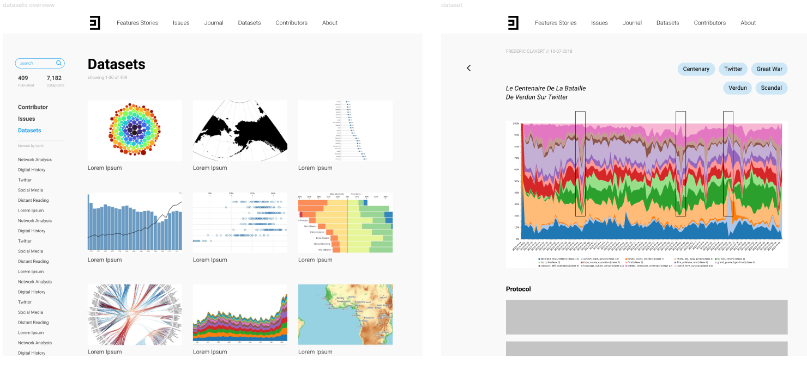{.r-stretch fig-align="center"}

::: notes 
Mirjam
:::

# Author info box

::: notes 
Mirjam
:::

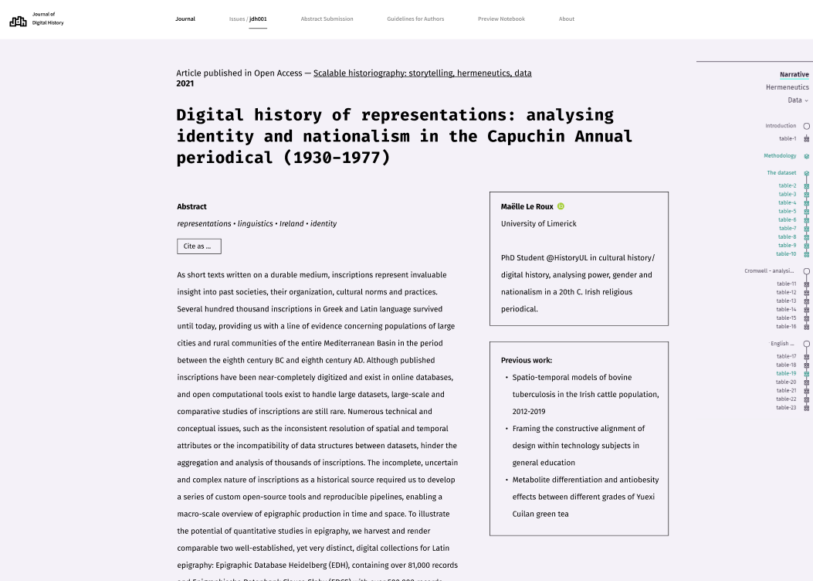{.r-stretch fig-align="center"}

# Storytelling

Video teaser

::: notes 
Mirjam
:::

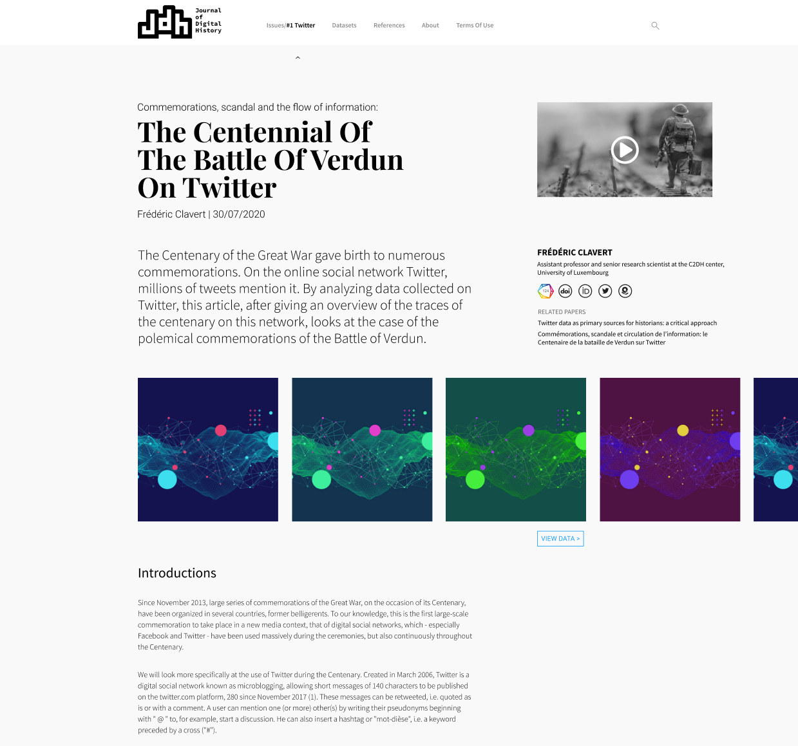{.r-stretch fig-align="center"}

# Archiving of the JDH

- Inserting the JDH into a solid open science framework
- Formalising the JDH’s editorial policy into an explicit open data / open science framework
- Discussion with Bibliothèque Nationale du Luxembourg (BnL)

::: notes 
Fréderic and Elisabeth
:::

# Explicit open data / open science framework

Based on the Foster Taxonomy see @koulocheri_what_2017
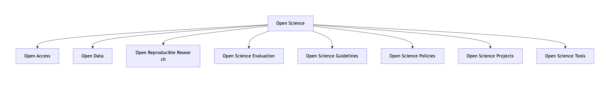{.r-stretch fig-align="center" width="95%"} 

::: notes 
Between creative freedom and formal standards: where JDH's three-layer practice meets Open Science requirements
:::

# Reproduciblity

Metadata:
- Partially
- Fully
- None

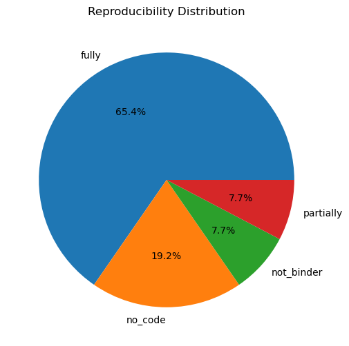{.r-stretch fig-align="center" width="50%"} 

# Example of practise: Data

- external repo - zenodo
- inside [github](https://github.com/jdh-observer/jdh001-L2gBr3BzwH8Z/tree/main/data)
-  MIA-Euronews Corpus, preserved in the MIA Database of the Medici Archive
- [available in the paper url](https://journalofdigitalhistory.org/en/article/7XSDVCtnbXva?idx=36) from Internet archive 
- 3D mesh
- oral interview
- catalogue image with metadata

# Using data accessibility statement

See @colavizza_citation_2020

- DAS 1: “Data available on request or similar”
- DAS 2: “Data available with the paper and its supplementary files”
- DAS 3: “Data available in a repository”

# Ideas

- Enrich metadata
- Reveal in the interface

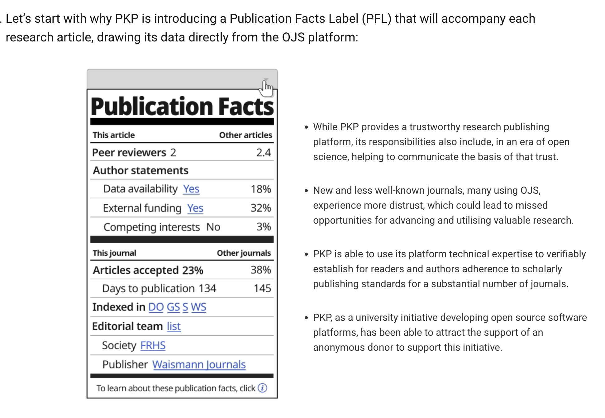{.r-stretch fig-align="right" width="50%"}

::: notes 

:::

# Let's do a short break

... we will restart later 😉

::: notes 
Fréderic and Elisabeth
:::

# Let's prioritize 💫

- visualisation framework
- AI for guidelines 
- AI in peer review
- article timeline
- entry points
- author info box
- storytelling: video teaser
- open science framework (archiving)

::: notes 
Mirjam & all the team
:::

# What will be our core beliefs ?

> Academic publishing now shows the same decline that has hit social media and online marketplaces. @rhodes_5_2026

Planning our next steps 💡

::: notes 
Mirjam & all the team
:::

# Bibliography

